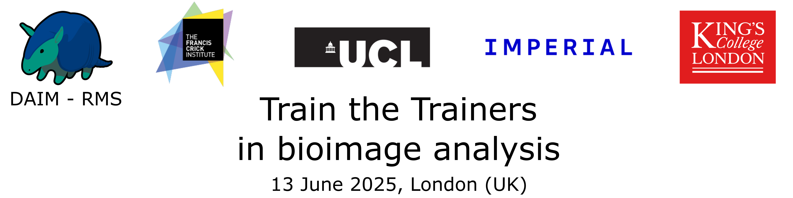

  

# Train_the_trainers 2025 - CrickPartnership-DAIM
The Royal Microscopical Society section Data Analysis in IMaging (RMS DAIM), with the support of the Crick and Partners Networking Fund, is organising a “Train the Trainers in Bioimage Analysis” workshop.

The Train the Trainers initiative aims to establish and disseminate guidelines on how to organise courses and train researchers in bioimage analysis. Attendees of the Train the Trainer session will become part of a network that provides local expertise and creates efficient channels for the dissemination of knowledge and good practices in bioimage analysis.

The event is free, and travel and accommodation support will be available for attendees outside the London area (max £100 pp).

Participants will be selected based on their expertise and role as trainers in bioimaging facilities or research groups. The target audience includes researchers with knowledge of bioimage analysis principles who wish to improve their skills in providing training.

Please apply here:
[Train the Trainers - DAIM-Crick Partnership - 2025 - application - Google Forms](https://docs.google.com/forms/d/e/1FAIpQLSdP0-xE9a_ge8JcybChEWs52VjcUHc51a1-brYVRZDyYUF1kg/viewform)

<b>Application deadline:  6th May 2025</b>

### Train the Trainers in Bioimage Analysis  - RMS DAIM-Crick & Partners

1 day workshop

Event Timing:
13th June 2025, 09:30-18:00

Event Location:
Room 1.20, Malet Place Engineering Building, University College London (London, UK)

Event type: in person

Capacity: max 30 participants

<b>Application deadline:  6th May 2025</b>

Communication to selected applicants: 15th May 2025

Contact: [rocco.dantuono@crick.ac.uk](mailto:rocco.dantuono@crick.ac.uk)
please use the following subject: Train the Trainers 2025 - DAIM-Crick Partnership

Programme in short:

13th June 2025

09:30 - 10:00 - Registration

10:00 - 10:30 - Welcome and self-introduction  

10:30 - 12:00 - Technical session and tool showcase

12:00 - 13:00 - Lunch

13:00 - 14:00 - How to organise bioimage analysis workshops

14:00 - 15:00 - Right teaching settings - Pedagogy of training (with Higher Education specialist)

15:00 - 15:30 - Call for help - Selected challenges in BIA training, proposed by participants

15:30 - 16:00 - Coffee break

16:00 - 17:00 - Panel discussion on BIA solutions and strategies for future training courses

17:00 - 17:30 - Wrap up

18:00 -  Drink and nibbles reception

Organisers:
[Rocco D’Antuono](https://github.com/RoccoDAnt) (the Francis Crick Institute), [Martin Jones](https://github.com/martlj) (the Francis Crick Institute),
[Stefania Marcotti](https://github.com/stemarcotti) (King’s College London), [David Barry](https://github.com/djpbarry) (The Francis Crick Institute), [David Gaboriau](https://profiles.imperial.ac.uk/d.gaboriau) (Imperial College London), [Giulia Paci](https://github.com/giuliapaci) (University College London), [Dale Moulding](https://github.com/DaleMoulding) (University College London)
